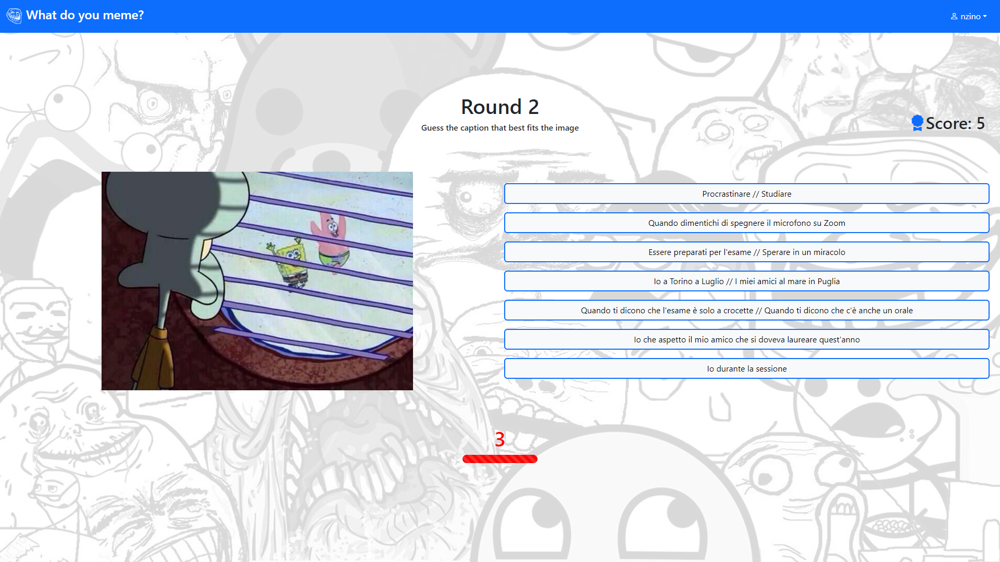
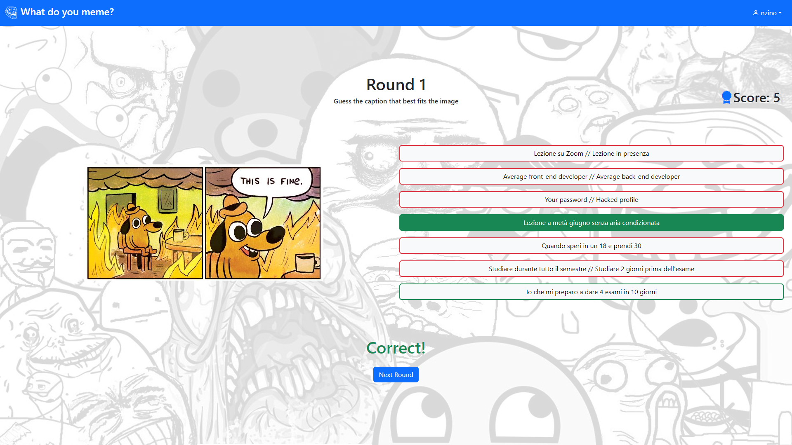

[](https://classroom.github.com/a/J0Dv0VMM)
# Exam #1: "What do you meme?"
## Student: s323112 AVANTAGGIATO VINCENZO 

## React Client Application Routes

- Route `/`: welcome page, it has 2 buttons to the main functionalities
- Route `/play`: route used to play the game, it renders the game instructions, the different rounds and the recap
- Route `/profile`: shows the logged user info and the history of the played games, if the user is not logged in it navigates to `/` 
- Route `/login`: shows the login form, if the user is logged in it navigates to `/` 
- Route `/logout`: application navigates to this route when a logout request is sent, when the server response arrives it navigates to `/`
- Route `/*`: default route, it signals that it doesn't match any route  

## API Server

- POST `/api/sessions`
  - Login request
  - Response: `201 Created` (success) or `401 Unauthorized` (wrong login).
  - Request body:
    ```
    { 
      username: 'nzino',
      password: 'password' 
    }
    ```
- GET `/api/sessions/current`
  - Current session request
  - Response: `200 OK` (success) or `401 Unauthorized` (Not authenticated).
- DELETE `/api/sessions/current`
  - Logout request
  - Response: `200 OK` (success)
- GET `/api/memes/random`
  - If the user is logged in retrive 3 random meme images, each with 7 captions (2 are correct). 
  - If the user is not logged in retrive 1 random meme image with 7 captions (2 are correct).
  - Response: `200 OK` (success) or `500 Internal Server Error` (generic error).
  - Response body:
    ```
    [
      {
        "captions": [
            {"id": 2, "text": "Esami a fine luglio"},
            {"id": 16, "text": "Lezione a metà giugno senza aria condizionata"},
            {"id": 1, "text": "Lezione alle 8:30"},
            {"id": 15, "text": "Io che mi preparo a dare 4 esami in 10 giorni"},
            {"id": 14, "text": "C'è un AI che fa i meme per te"},
            {"id": 6,"text": "Io a Torino a Luglio // I miei amici al mare in Puglia"},
            {"id": 19, "text": "Average python fan // Average C enjoyer"}
        ],
        "id": 1,
        "image_path": "meme1.jpg"
      },
      ...
    ]
    ```
- GET `/api/memes/:id/captions` 
  - Retrieve the correct captions of a meme given its image `id`
  - Response: `200 OK` (success) or `500 Internal Server Error` (generic error).
  - Response body:
    ```
    [
      {"id": 5, "text": "Io durante la sessione"},
      {"id": 1, "text": "Lezione alle 8:30"},
      ...
    ]
    ```
- POST `/api/games`
  - Save a new game
  - Response: `201 Created` (success), `401 Unauthorized` (user is not logged in), `422 Unprocessable Content`(wrong parameters) or `500 Internal Server Error` (generic error).
  - Request body:
    ```
    {
      scores: [0,0,5],
      images: [
        'meme9.jpg',
        'meme10.jpg',
        'meme2.jpg'
      ]
    }
    ```
- GET `/api/games`
  - Get all games of the requesting user
  - Response: `200 OK` (success), `401 Unauthorized` (user is not logged in) or `500 Internal Server Error` (generic error).
  - Response body:
    ```
    [
      {
        "id": 1,
        "user_id": 1,
        "scores": [0,0,0],
        "images": [
            "meme3.jpg",
            "meme10.jpg",
            "meme8.jpg"
        ]
      },
      ...
    ]
    ```

## Database Tables

- Table `captions` 
  - contains: 
    - `id` (INTEGER)
    - `text` (TEXT)
  - primary key:
    - `id`
- Table `images` 
  - contains: 
    - `id` (INTEGER) 
    - `image_path` (TEXT)
  - primary key:
    - `id`
- Table `image_caption` 
  - contains: 
    - `image_id` (INTEGER)
    - `caption_id` (INTEGER)
  - primary key:
    - `image_id` + `caption_id`
  - foreign keys:
    - `image_id` &rarr; `images.id`
    - `caption_id` &rarr; `captions.id`
- Table `users` 
  - contains: 
    - `id` (INTEGER)
    - `username` (TEXT)
    - `password` (TEXT)
    - `salt` (TEXT)
  - primary key:
    - `id`
- Table `games` 
  - contains: 
    - `id` (INTEGER)
    - `user_id` (INTEGER)
    - `score_round1` (INTEGER)
    - `score_round2` (INTEGER)
    - `score_round3` (INTEGER)
    - `image_round1` (TEXT)
    - `image_round2` (TEXT)
    - `image_round3` (TEXT)
  - primary key:
    - `id`
  - foreign key:
    - `user_id` &rarr; `users.id`

## Main React Components

- `Header` (in `Header.jsx`): navigation bar, it shows the brand name with a link to `/`, a login button for the unauthenticated or a dropdown menu for the logged user
- `LoginForm` (in `LoginForm.jsx`): form to manage login
- `NotFound` (in `NotFound.jsx`): it shows the not found message
- `WelcomePage` (in `WelcomePage.jsx`): it shows a welcome message if the user is not logged in, with a button to play and a button to login; if the user is logged in it shows a button to play and a button to see the user's profile
- `GamePage` (in `GameComponents.jsx`): wraps and manages `Instructions`, `Round` and `Recap`
- `Instructions` (in `GameComponents.jsx`): it shows the game istructions
- `Round` (in `GameComponents.jsx`): it shows meme image and captions to guess 
- `Recap` (in `GameComponents.jsx`): sums up the results of the game
- `Timer` (in `GameComponents.jsx`): timer countdown
- `ProfilePage` (in `ProfileComponents.jsx`): wraps `Profile` and `PreviousGames`
- `Profile` (in `ProfileComponents.jsx`): it shows the user info pus some statistics
- `PreviousGames` (in `ProfileComponents.jsx`): shows user's previous games
- `Details` (in `ProfileComponents.jsx`): shows game details on a OffCanvas

## Screenshot




## Users Credentials

- username: `nzino`, password: `password`
- username: `luigi`, password: `password`
